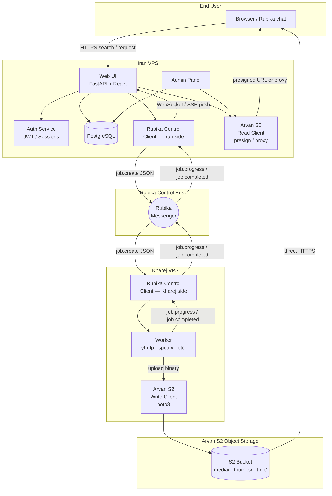

# Arvan WebUI Migration — Research & Design Document

> **Status**: Research / Pre-implementation  
> **Last updated**: 2026-04-26  
> **Scope**: Architecture design only — no existing source files are modified in this PR.

---

## Overview

RubeTunes currently uses the **Rubika** messenger for both control messages *and* binary file transfers between two VPS nodes.  This document defines the next architectural evolution:

| Concern | Current | Target |
|---------|---------|--------|
| Control messages (search queries, job status, admin commands) | Rubika | **Rubika** (unchanged) |
| Binary file transfer (audio, video, zips, thumbnails) | Rubika | **Arvan Cloud S2 Object Storage** |
| End-user interface | Rubika chat only | **Modern Web UI** (Iran VPS) + Rubika |
| Admin management | `!admin` bot commands | **Admin Panel** (Web UI) + Rubika commands |

The migration is designed to be executed by **two developers in parallel** with minimal blocking (see [`task-split.md`](task-split.md)).

---

## Goals

1. **Keep Rubika lean** — only small JSON control messages travel over Rubika; no binary blobs.
2. **Fast, reliable file delivery** — media files live in Arvan S2; end users receive presigned download URLs or stream through the Iran VPS proxy.
3. **Preserve every existing RubeTunes feature** — see [`current-features.md`](current-features.md) for the complete inventory.
4. **Modern, RTL-first Web UI** — responsive, dark-mode default, Persian-friendly, accessible.
5. **Admin Panel** — user registration approval, whitelist/block, queue visibility, S2 usage, settings editor.
6. **Two-developer parallel delivery** — clean Track A / Track B split with a shared contract defined before coding begins.

## Non-Goals

- This PR introduces **no code changes** to existing modules (`rub.py`, `main.py`, `spotify_dl.py`, `zip_split.py`, `rubetunes/**`, `Dockerfile`, `docker-compose.yml`, `requirements*.txt`).
- We are **not** replacing the Rubika bot entirely — it remains the control channel between the two VPSes and as an optional interface for existing users.
- We are **not** migrating to a different download stack (yt-dlp, Spotify, Tidal, Qobuz, etc. remain unchanged).
- We are **not** adding new download sources in this migration.

---

## High-Level Architecture

---

## Glossary

| Term | Definition |
|------|------------|
| **Kharej VPS** | The VPS located outside Iran ("kharej" = outside/abroad in Persian). Runs yt-dlp, spotify, tidal, qobuz download workers. Has outbound internet access to media platforms. |
| **Iran VPS** | The VPS located inside Iran. Runs the Web UI and Admin Panel. Reachable by Iranian end users without VPN. |
| **Arvan S2** | Arvan Cloud's S3-compatible object storage service. Used to transfer binary media files between VPSes and to deliver files to end users. |
| **Control bus** | The Rubika messenger channel used exclusively for small JSON control messages between the two VPSes. No binary payloads pass through it. |
| **Presigned URL** | A time-limited, cryptographically signed URL generated by the Iran VPS that grants a specific user direct read access to an S2 object. |
| **Track A** | Developer A's work scope: Kharej Worker + S2 write client + Rubika control client refactor. See [`task-split.md`](task-split.md). |
| **Track B** | Developer B's work scope: Iran VPS Web UI + Admin Panel + Auth + S2 read client + DB. See [`task-split.md`](task-split.md). |
| **job.create / job.completed** | JSON message types that flow over Rubika. See [`message-schema.md`](message-schema.md). |
| **ISRC** | International Standard Recording Code — used internally to match tracks across providers. |
| **Circuit breaker** | Automatic provider failure detection; failing providers are skipped temporarily. Lives in `rubetunes/circuit_breaker.py`. |

---

## Documents in This Folder

| File | Description |
|------|-------------|
| **[current-features.md](current-features.md)** | Exhaustive inventory of every RubeTunes feature, grounded in the current codebase, with migration mapping. |
| **[architecture.md](architecture.md)** | Detailed component breakdown, Mermaid sequence diagrams, S2 bucket layout, failure modes, security model. |
| **[webui-spec.md](webui-spec.md)** | Pages, routes, UI/UX requirements, tech-stack recommendation, auth model for the Web UI and Admin Panel. |
| **[task-split.md](task-split.md)** | Two-developer split (Track A and Track B) with checklists, effort estimates, and shared contracts. |
| **[message-schema.md](message-schema.md)** | Concrete JSON schemas and examples for every Rubika control message. |
| **[migration-plan.md](migration-plan.md)** | Phased rollout plan, backward compatibility notes, risk register. |
| **[open-questions.md](open-questions.md)** | Items requiring owner confirmation before implementation begins. |
