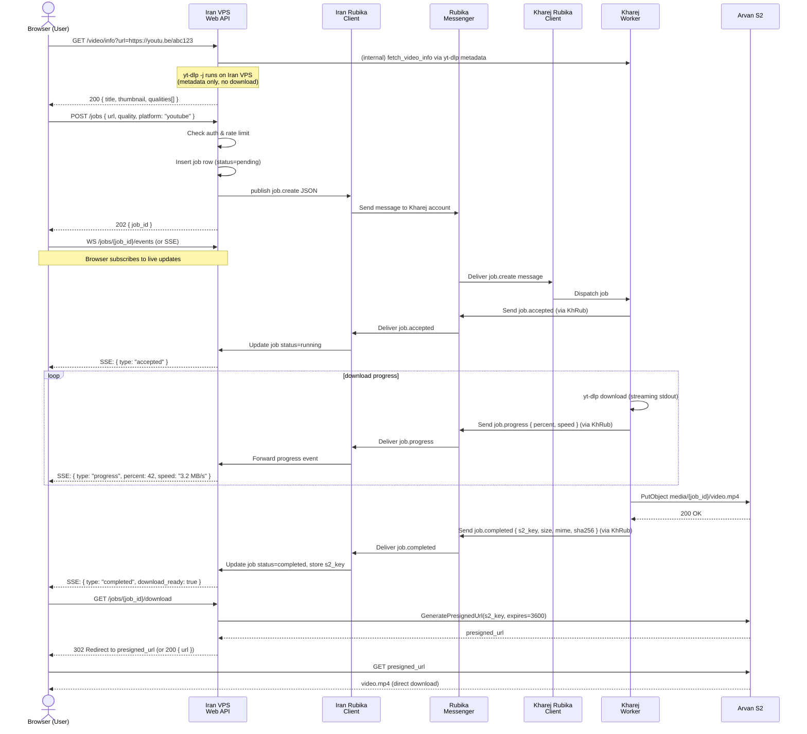
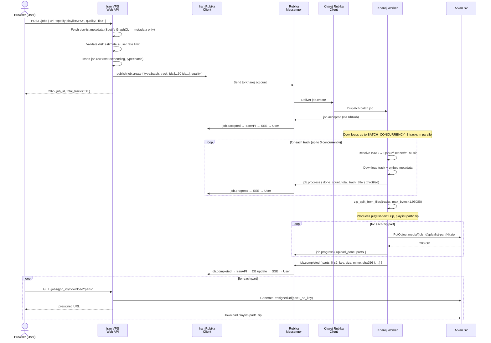

# Architecture — Arvan WebUI Migration

> See also: [current-features.md](current-features.md) · [message-schema.md](message-schema.md) · [task-split.md](task-split.md)

---

## 1. Component Breakdown

### 1.1 Iran VPS Services

```
Iran VPS
├── nginx                   Reverse proxy / TLS termination
├── web-api                 FastAPI application (REST + WebSocket/SSE)
│   ├── auth                JWT issuance, refresh, registration flow
│   ├── jobs                POST /jobs → publishes job.create to Rubika
│   ├── stream              WebSocket/SSE — pushes job.progress/completed to browser
│   ├── downloads           GET /downloads/{job_id}/url → presigned S2 URL or proxy stream
│   └── admin               Admin API (users, queue, storage, settings, audit)
├── web-ui (React / Next.js SPA)
│   ├── Public pages        Landing, login, register, search, result, library
│   └── Admin Panel         Users, registrations, queue, storage, settings, audit log
├── db (PostgreSQL)         Users, jobs, audit log, settings, registration approvals
├── rubika-client-ir        rubpy client subscribed to the Rubika control channel
│   └── event bridge        Receives job.progress/completed → pushes to SSE bus
└── redis (optional)        SSE fanout, session cache
```

**Database recommendation: PostgreSQL**

Reasons:
- Supports `LISTEN/NOTIFY` for cheap in-process event fanout (alternative to Redis for small deployments).
- Strong JSON column support for flexible job metadata and audit payloads.
- Row-level security for multi-tenant admin access.
- `pg_trgm` extension for fast full-text audit log search.
- SQLite is simpler but lacks concurrent write safety when the API and the Rubika client both write simultaneously (especially under load with multiple workers).

**Auth service**

- Registration → pending approval state.
- Admin approves → `user.status = 'active'` in DB; optionally sends `user.whitelist.add` control message to Kharej.
- JWT access tokens (15 min TTL) + refresh tokens (7 days, stored in `httpOnly` cookie).
- Password hashed with bcrypt (cost factor 12).

**Rubika control client (Iran side)**

- Maintains a single `rubpy` session authenticated with the Iran-side Rubika account.
- On receiving a `job.create` REST call from the Web API, serialises a JSON message and sends it to the Kharej-side account via Rubika.
- Subscribes to incoming Rubika messages from the Kharej-side account; parses `job.progress`, `job.completed`, `job.failed` JSON; pushes events to the SSE/WebSocket broadcast bus.

**Arvan S2 read client**

Two strategies are supported (see open-questions.md):

| Strategy | Pros | Cons |
|----------|------|------|
| **Presigned URL** (recommended default) | No traffic through Iran VPS; direct S2 → user; minimal Iran VPS egress cost | URL contains a signed token; harder to revoke; 1-hour default TTL |
| **Proxy stream** | Iran VPS controls every download; easy to revoke access; can add progress tracking | All S2 → user traffic routes through Iran VPS; adds bandwidth cost and CPU load |

Recommendation: **presigned URLs** by default; proxy stream as a fallback for clients behind restrictive firewalls. TTL: 1 hour, configurable.

---

### 1.2 Kharej VPS Services

```
Kharej VPS
├── worker                  Asyncio worker process (refactored from rub.py)
│   ├── rubika-client-kh    rubpy client receiving job.create messages
│   ├── job-dispatcher      Parses job type, calls appropriate downloader
│   ├── downloaders
│   │   ├── youtube         yt-dlp video/audio, quality selection
│   │   ├── spotify         SpotiFLAC GraphQL → ISRC → waterfall
│   │   ├── tidal           Monochrome port
│   │   ├── qobuz           Auto-scraped credentials + auth fallback
│   │   ├── amazon          Proxy ISRC resolver
│   │   ├── soundcloud      yt-dlp
│   │   ├── bandcamp        yt-dlp
│   │   └── musicdl         40+ source library
│   ├── zip-splitter        zip_split.py — batch ZIP packaging
│   ├── tagger              rubetunes/tagging.py — embed ID3/FLAC/M4A tags
│   └── progress-reporter   Publishes job.progress every N seconds
├── s2-client               boto3 S3-compatible client (write-only credentials)
│   ├── uploader            Multipart upload with retry
│   └── lifecycle mgr       Tag objects with TTL metadata
└── metrics                 Prometheus /metrics on port 9091
```

**Worker flow**

1. Rubika client receives a Rubika message from the Iran-side account.
2. Worker parses the JSON body (field `"type": "job.create"`).
3. Access control check: is the requesting user whitelisted/not-banned? (local in-memory state kept in sync via `user.whitelist.*` control messages).
4. Dispatch to the appropriate downloader based on `job.platform` field.
5. Downloader produces one or more files in a temp directory.
6. For batch jobs (playlist/album): `zip_split.py` packages files; `tagger.py` embeds metadata.
7. S2 client uploads each file/part to `media/{job_id}/{filename}`.
8. After each upload, publishes a `job.progress` message; after the last upload publishes `job.completed` with object keys, sizes, MIME types, and SHA-256 checksums.
9. On any failure: publishes `job.failed` with `error_code` and `message`.
10. Local temp files are deleted after successful S2 upload.

---

### 1.3 Arvan S2 Object Storage

**Bucket layout**

```
rubetunes-media/               (single bucket, two environments: staging / production)
├── media/
│   ├── {job_id}/
│   │   ├── {safe_filename}.mp3
│   │   ├── {safe_filename}.flac
│   │   ├── {safe_filename}-part1.zip
│   │   └── {safe_filename}-part2.zip
│   └── …
├── thumbs/
│   └── {isrc_or_job_id}.jpg   (cover art, uploaded by Kharej worker)
└── tmp/
    └── {job_id}/              (multipart upload staging; cleaned by lifecycle rule)
```

**Object tagging**

Each object is tagged with:
```
job_id     = {uuid}
user_id    = {user_id}
platform   = spotify | youtube | tidal | …
created_at = {ISO-8601}
ttl_days   = 7
```

**Lifecycle rules**

| Prefix | Action | Trigger |
|--------|--------|---------|
| `media/` | Delete | 7 days after object creation (default; configurable) |
| `tmp/` | Delete | 24 hours after creation (orphan cleanup) |
| `thumbs/` | No auto-delete | Thumbnails are small; retain indefinitely |

**ACL / credential split**

| Principal | S2 Credentials | Allowed actions |
|-----------|---------------|-----------------|
| Kharej VPS | `ARVAN_S2_ACCESS_KEY_WRITE` / `ARVAN_S2_SECRET_KEY_WRITE` | `PutObject`, `DeleteObject`, `AbortMultipartUpload` |
| Iran VPS | `ARVAN_S2_ACCESS_KEY_READ` / `ARVAN_S2_SECRET_KEY_READ` | `GetObject`, `ListBucket` (read-only), `GeneratePresignedUrl` |

The two sets of credentials are created as separate IAM-equivalent accounts in Arvan Cloud Console.  The write credentials **never leave Kharej VPS**; the read credentials **never leave Iran VPS**.

**boto3 SDK**

Arvan S2 is S3-compatible. Example configuration:

```python
import boto3
from botocore.config import Config

s3 = boto3.client(
    "s3",
    endpoint_url="https://s3.ir-thr-at1.arvanstorage.ir",  # confirm region — see open-questions.md
    aws_access_key_id=ARVAN_ACCESS_KEY,
    aws_secret_access_key=ARVAN_SECRET_KEY,
    config=Config(retries={"max_attempts": 5, "mode": "adaptive"}),
)
```

**Presigned URL generation (Iran VPS)**

```python
url = s3.generate_presigned_url(
    "get_object",
    Params={"Bucket": "rubetunes-media", "Key": f"media/{job_id}/{filename}"},
    ExpiresIn=3600,  # 1 hour
)
```

---

### 1.4 Rubika as Control Bus

**Principles**

- **No binary payloads** ever travel over Rubika.  Only small JSON strings.
- Each message fits comfortably within Rubika's text message size limit (keep under 4 KB).
- All messages are serialised as UTF-8 JSON strings prefixed with a magic marker for routing: `RTUNES::` followed by the JSON body.
- The full message schema is defined in [`message-schema.md`](message-schema.md).

**Message types**

| Type | Direction | Description |
|------|-----------|-------------|
| `job.create` | Iran → Kharej | User requests a download |
| `job.accepted` | Kharej → Iran | Worker has accepted the job |
| `job.progress` | Kharej → Iran | Download / upload progress update |
| `job.completed` | Kharej → Iran | All files uploaded to S2; includes object keys |
| `job.failed` | Kharej → Iran | Job failed; includes error details |
| `user.whitelist.add` | Iran → Kharej | Add user to Kharej's local whitelist |
| `user.whitelist.remove` | Iran → Kharej | Remove user from Kharej's local whitelist |
| `user.block.add` | Iran → Kharej | Block a user on Kharej side |
| `user.block.remove` | Iran → Kharej | Unblock a user |
| `health.ping` | Iran → Kharej | Request health data |
| `health.pong` | Kharej → Iran | Health response with provider states |
| `admin.clearcache` | Iran → Kharej | Flush metadata caches |

---

## 2. Sequence Diagrams

### 2.1 Typical "User Requests a YouTube Video" Flow



---

### 2.2 Spotify Playlist (Multi-File) Flow



---

## 3. Failure Modes and Retries

### 3.1 S2 Upload Failure

**Detection**: `boto3` raises `ClientError` or connection timeout.

**Retry strategy**:
1. `botocore.config.Config(retries={"max_attempts": 5, "mode": "adaptive"})` — exponential back-off with jitter, automatic on all idempotent operations.
2. For multipart uploads: track which parts have been uploaded successfully; resume from the last successful part (do not re-upload completed parts).
3. If all 5 attempts fail: publish `job.failed` with `error_code: "s2_upload_failed"` and abort the multipart upload (`AbortMultipartUpload`) to avoid orphaned parts.

**Orphaned object cleanup**: The `tmp/` lifecycle rule (24-hour TTL) handles orphaned multipart staging parts automatically.

### 3.2 Rubika Disconnect

**Detection**: `rubpy` client loses connection (network error, session expiry).

**Mitigation**:
- Both VPSes run the Rubika client in a supervised async loop that reconnects with exponential back-off (1 s → 2 s → 4 s → … → 60 s max).
- In-flight job state is persisted to disk (JSON file or DB) so reconnection does not lose the job.
- The Iran VPS maintains a `last_seen` heartbeat for the Kharej control client; if no `health.pong` is received within 2 minutes, the Admin Panel shows a "Kharej VPS disconnected" alert.

### 3.3 Partial Uploads / Orphaned Objects

**Scenario**: Worker uploads 3 of 5 zip parts then crashes.

**Mitigation**:
- The `job.completed` message lists *all* expected `s2_keys`. The Iran VPS only marks a job as completed when all keys are present (verified via `HeadObject` or checksum matching).
- Orphaned objects in `media/{job_id}/` are deleted by a nightly cleanup job that queries the DB for jobs in `failed` or `timed_out` state and calls `DeleteObject` on any associated S2 keys.
- The `tmp/` 24-hour lifecycle rule catches any multipart staging debris.

### 3.4 Presigned URL Expiry Before User Downloads

**Scenario**: User's download link expires before they click it.

**Mitigation**: The Iran Web API regenerates presigned URLs on demand; the `/jobs/{job_id}/download` endpoint always generates a fresh URL from the stored `s2_key`.

### 3.5 Kharej VPS Cannot Reach a Download Source

**Mitigation**: Circuit breaker auto-skips failing providers. The waterfall resolution chain tries the next provider. On complete exhaustion, `job.failed` is published with `error_code: "no_source_available"`.

---

## 4. Security Model

### 4.1 S2 Credential Split

See section 1.3.  Write credentials are **exclusively** on Kharej VPS; read/presign credentials are **exclusively** on Iran VPS.  Never swap or share.

### 4.2 Presigned URL Security

- Default TTL: 1 hour (configurable via `PRESIGNED_URL_TTL_SEC`).
- URLs contain the S2 signature; they are single-use from the S2 side only in the sense that they can only download the exact object they target.
- For extra security, the Iran Web API can wrap presigned URLs in a short-lived (1-use, 5-minute) signed token stored in DB. The `/download` endpoint validates this token and then redirects to the presigned URL. This prevents link sharing.

### 4.3 Rubika Message Integrity

- Messages are prefixed with `RTUNES::` and both sides validate this prefix before parsing.
- Message size is checked (reject messages >4 KB to prevent memory exhaustion).
- Version field `"v": 1` is validated; future breaking changes bump the version.
- The Kharej client ignores any message not originating from the known Iran-side Rubika account GUID.

### 4.4 Web UI Auth

- JWT tokens are `httpOnly`, `Secure`, `SameSite=Strict` cookies.
- Access token TTL: 15 minutes.  Refresh token TTL: 7 days, stored in DB with a `revoked` flag.
- Registration flow: user submits email + password → `status=pending_approval` → admin approves in Admin Panel → user receives activation email (or is told to try again).
- Admin API routes require `role=admin` claim in the JWT.

### 4.5 Rate Limiting and SSRF Prevention

- The Iran Web API validates and sanitises URLs submitted by users (only allow known CDN / platform domains; reject `localhost`, private IP ranges, etc.) before they are included in `job.create` messages.
- Per-user rate limiting is enforced at the API layer (DB-backed rolling window).
