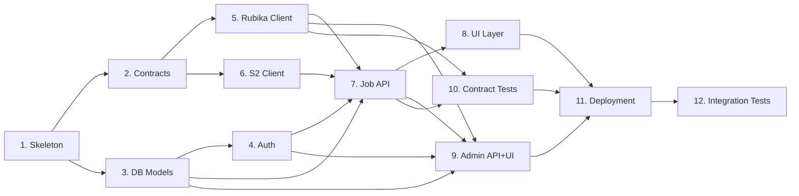

# Track B — Step-by-Step Implementation Plan (Python)

> Companion to [`task-split.md`](task-split.md). This file expands **Track B — "Iran VPS Web UI + Admin Panel + Auth"** into a sequential, actionable roadmap implemented entirely in Python.
>
> Other relevant docs: [`architecture.md`](architecture.md) · [`message-schema.md`](message-schema.md) · [`CONTRACTS.md`](CONTRACTS.md) · [`track-a-steps.md`](track-a-steps.md)

**Owner**: Full-stack developer (Iran VPS)  
**VPS**: Iran VPS  
**Stack**: Python 3.11+, FastAPI + Uvicorn, pydantic-settings, SQLAlchemy 2 + asyncpg, Alembic, boto3 (read-only S2), rubpy (Rubika client), Jinja2 or React SPA (see Step 8), pytest + pytest-asyncio + httpx.  
**Total estimated effort**: ~44 developer-days.

> **Why FastAPI + Uvicorn (not Django)?**  
> The Iran VPS is I/O-bound: it needs concurrent SSE/WebSocket connections to push live job-progress events, and an async Rubika listener running alongside the HTTP server in the same process. FastAPI's native `async def` support and ASGI lifecycle hooks make this straightforward.  Django's WSGI-first design makes long-lived SSE and async background tasks more complex (ASGI mode exists but ORM async support is immature).  FastAPI + SQLAlchemy 2 async + `asyncpg` gives us a 100 % async stack with minimal boilerplate.

---

## Overview of the 12 Steps

| # | Step | Phase | Effort | Depends on |
|---|------|-------|--------|------------|
| 1 | Project skeleton & `iran/` package layout | Foundation | 0.5 d | — |
| 2 | Contracts mirror (import kharej.contracts) | Foundation | 0.5 d | 1, Track A Step 2 |
| 3 | Database models + Alembic migrations | Foundation | 2 d | 1 |
| 4 | Auth service (JWT, registration, approval) | Foundation | 2 d | 3 |
| 5 | Iran-side Rubika transport client | Foundation | 2 d | 2 |
| 6 | S2 read client (presigned URLs + proxy) | Foundation | 1 d | 2 |
| 7 | Core job API (POST /jobs, SSE, cancel) | API | 2 d | 3, 4, 5, 6 |
| 8 | UI layer (public pages + job forms + progress) | Frontend | 5 d | 7 |
| 9 | Admin/control plane API + UI | Admin | 4 d | 3, 4, 5, 7 |
| 10 | Contract test strategy (golden fixtures) | Testing | 2 d | 5, 7 |
| 11 | Deployment (Dockerfile, docker-compose, .env) | Deployment | 1 d | all |
| 12 | End-to-end integration tests | Testing | 3 d | all |

> Steps 1–6 are the **critical path** — nothing else is functional until they pass. Steps 7 and 9 can be worked on in parallel once Step 5 is ready. Steps 10–12 finalize the track.

---

## Step 1 — Project Skeleton & Package Layout ✅

> ✅ **Done** — `iran/` package implemented with `iran/__init__.py`, `iran/__main__.py` (CLI with `--version`, `--check-config`, `--help`), `iran/main.py` (FastAPI app factory + ASGI lifespan + DI wiring stubs), `iran/config.py` (`IranSettings` via pydantic-settings, `IRAN_` prefix), `iran/logging_setup.py` (JSON/text), `iran/api/health.py` (`GET /health`), and protocol-based DI stubs for `iran/rubika_client.py`, `iran/s2_client.py`, `iran/event_bus.py`. `tests/test_iran_step1.py` adds 27 tests covering package importability, health endpoint, settings parsing from env, CLI flags, and DI stub protocols. `python -c "import iran"` exits 0; `python -m iran --help` prints usage; `python -m iran --check-config` validates env config.

**Goal**: Create the `iran/` Python package with the agreed structure so every later step has a place to land.

**Substeps**

1. Create directory tree:
   ```
   iran/
     __init__.py
     main.py                # FastAPI application factory + lifespan
     config.py              # pydantic-settings IranSettings
     api/
       __init__.py
       auth.py              # /auth/register, /auth/login, /auth/refresh, /auth/logout
       jobs.py              # POST /jobs, GET /jobs/{id}, GET /jobs/{id}/events, DELETE /jobs/{id}
       downloads.py         # GET /jobs/{id}/download[?part=N]
       search.py            # GET /search
       admin.py             # /admin/* endpoints
     db/
       __init__.py
       engine.py            # async SQLAlchemy engine + session factory
       models.py            # ORM models
       migrations/          # Alembic env + versions/
     rubika_client.py       # Iran-side Rubika transport
     s2_client.py           # S2 read-only client + presign
     event_bus.py           # In-process SSE/WS fan-out
     tests/
       conftest.py
       test_auth.py
       test_jobs.py
       test_rubika_client.py
       test_s2_client.py
       test_admin.py
       test_contracts.py
     static/                # React build output (or Jinja2 templates)
     templates/             # Jinja2 templates (if server-rendered)
   ```
2. Add `iran/__main__.py`:
   ```python
   import uvicorn
   from iran.main import create_app
   uvicorn.run(create_app(), host="0.0.0.0", port=8000)
   ```
3. Add `iran/requirements.txt` pinning:
   - `fastapi`, `uvicorn[standard]`, `pydantic`, `pydantic-settings`
   - `sqlalchemy[asyncio]`, `asyncpg`, `alembic`
   - `boto3`, `botocore`
   - `rubpy` (or the same Rubika lib used by Track A)
   - `python-jose[cryptography]`, `passlib[bcrypt]`
   - `tenacity`, `pytest`, `pytest-asyncio`, `httpx`
4. Add `iran/README.md` with a one-paragraph description and links to this roadmap.

**Deliverable**: Committed empty package; `python -c "import iran"` returns 0.

**Acceptance**: `python -m iran --help` prints a usage stub (or uvicorn startup message).

---

## Step 2 — Contracts Mirror (Joint with Track A)

**Goal**: Import the frozen contracts from Track A so Iran-side code uses the *identical* Pydantic models, encode/decode helpers, and S2 key helpers — no duplication.

✅ **Pre-condition complete** — contracts frozen at `v=1` in [`kharej/contracts.py`](../../../kharej/contracts.py). See [`CONTRACTS.md`](CONTRACTS.md).

**Substeps**

1. In `iran/config.py`, add a `CONTRACT_VERSION` assertion:
   ```python
   from kharej.contracts import CONTRACT_VERSION
   assert CONTRACT_VERSION == 1, "Bump iran/ code if contracts changed"
   ```
2. Write a thin re-export shim `iran/contracts.py` (optional but recommended for IDE clarity):
   ```python
   # iran/contracts.py — re-exports only what Iran VPS needs
   from kharej.contracts import (
       JobCreate, JobAccepted, JobProgress, JobCompleted, JobFailed, JobCancel,
       UserWhitelistAdd, UserWhitelistRemove, UserBlockAdd, UserBlockRemove,
       AdminClearcache, AdminSettingsUpdate, AdminCookiesUpdate, AdminAck,
       HealthPing, HealthPong,
       S2ObjectRef, JobStatus, Platform, AccessDecision,
       AnyMessage, encode, decode,
       make_media_key, make_part_key, make_thumb_key, make_tmp_prefix,
       CONTRACT_VERSION, RTUNES_PREFIX, MAX_MESSAGE_BYTES,
   )
   ```
3. All Iran-side code that sends or receives Rubika messages must use `iran.contracts.encode` / `iran.contracts.decode` (which are the same functions as in `kharej.contracts`).
4. Review every field of `JobCreate`, `JobCompleted`, and `HealthPong` against the wire format in [`message-schema.md`](message-schema.md). Confirm each field matches before proceeding to Step 5.

**Wire-format reminder** (every message):
```json
{
  "v": 1,
  "type": "<type-string>",
  "ts": "2026-04-26T17:05:56Z",
  "job_id": "<uuid-v4 or null>"
}
```

**Deliverable**: `iran/contracts.py` shim + a `tests/test_contracts.py` that round-trips every message type through `encode` → `decode` and asserts field equality.

**Acceptance**:
- `pytest iran/tests/test_contracts.py` passes (100 % of message types exercised).
- `from iran.contracts import JobCreate` works without importing kharej directly.

---

## Step 3 — Database Models + Alembic Migrations

**Goal**: Persistent storage for users, jobs, audit log, settings, refresh tokens, and registration approvals.

**Substeps**

1. `iran/db/models.py` — SQLAlchemy 2 mapped classes (using `MappedColumn`):

   **`users`**
   ```sql
   id            UUID PK  DEFAULT gen_random_uuid()
   email         TEXT UNIQUE NOT NULL
   display_name  TEXT NOT NULL
   password_hash TEXT NOT NULL
   role          TEXT NOT NULL DEFAULT 'user'    -- 'user' | 'admin'
   status        TEXT NOT NULL DEFAULT 'pending_approval'
                   -- 'pending_approval' | 'active' | 'blocked' | 'deleted'
   rubika_guid   TEXT                           -- optional cross-reference
   created_at    TIMESTAMPTZ DEFAULT NOW()
   last_seen_at  TIMESTAMPTZ
   ```

   **`jobs`** (see [`task-split.md` §3.4](task-split.md))
   ```sql
   id            UUID PK   -- generated by Iran VPS before job.create
   user_id       UUID FK → users.id
   platform      TEXT NOT NULL
   url           TEXT NOT NULL
   quality       TEXT
   job_type      TEXT NOT NULL DEFAULT 'single'  -- 'single' | 'batch'
   status        TEXT NOT NULL DEFAULT 'pending' -- JobStatus enum values
   progress      INT  DEFAULT 0
   speed         TEXT
   phase         TEXT                            -- JobProgress.phase
   error_code    TEXT
   error_msg     TEXT
   s2_keys       JSONB                           -- list[S2ObjectRef as dict]
   total_tracks  INT
   done_tracks   INT DEFAULT 0
   failed_tracks INT DEFAULT 0
   current_track TEXT
   metadata_json JSONB                           -- JobCompleted.metadata
   created_at    TIMESTAMPTZ DEFAULT NOW()
   accepted_at   TIMESTAMPTZ
   completed_at  TIMESTAMPTZ
   ```

   **`refresh_tokens`**
   ```sql
   id        UUID PK
   user_id   UUID FK → users.id
   token     TEXT UNIQUE NOT NULL   -- SHA-256 of raw token
   issued_at TIMESTAMPTZ DEFAULT NOW()
   expires_at TIMESTAMPTZ NOT NULL
   revoked   BOOLEAN DEFAULT FALSE
   ```

   **`audit_log`**
   ```sql
   id         UUID PK DEFAULT gen_random_uuid()
   actor_id   UUID FK → users.id (nullable for system events)
   action     TEXT NOT NULL   -- 'job.create' | 'user.approve' | 'settings.update' | …
   target_id  TEXT            -- job_id or user_id being acted upon
   payload    JSONB           -- message/params snapshot
   ip_addr    TEXT
   created_at TIMESTAMPTZ DEFAULT NOW()
   ```

   **`settings`**
   ```sql
   key        TEXT PK
   value      TEXT NOT NULL
   updated_at TIMESTAMPTZ DEFAULT NOW()
   ```

   **`registrations`** (pending approvals inbox)
   ```sql
   id          UUID PK DEFAULT gen_random_uuid()
   user_id     UUID UNIQUE FK → users.id
   notes       TEXT
   reviewed_by UUID FK → users.id (nullable)
   reviewed_at TIMESTAMPTZ
   ```

2. `iran/db/engine.py`:
   ```python
   from sqlalchemy.ext.asyncio import create_async_engine, async_sessionmaker
   engine = create_async_engine(settings.DATABASE_URL, pool_pre_ping=True)
   AsyncSession = async_sessionmaker(engine, expire_on_commit=False)
   ```
3. Alembic `env.py`: configure `target_metadata = Base.metadata` and `asyncpg` dialect.
4. Generate initial migration: `alembic revision --autogenerate -m "initial schema"`.

**Deliverable**: `iran/db/models.py`, `iran/db/engine.py`, `iran/db/migrations/`.

**Acceptance**:
- `alembic upgrade head` against a local PostgreSQL instance completes with no errors.
- A unit test (`pytest iran/tests/test_db.py`) using `pytest-asyncio` + SQLite (`:memory:`) verifies insert/select on every table.

---

## Step 4 — Auth Service (JWT + Registration + Approval Flow)

**Goal**: Secure, stateless JWT authentication with admin-gated registration.

**Substeps**

1. `iran/api/auth.py` — endpoints:

   | Method | Path | Auth | Description |
   |--------|------|------|-------------|
   | `POST` | `/auth/register` | Public | Create user (`status=pending_approval`), insert `registrations` row, write `audit_log` |
   | `POST` | `/auth/login` | Public | Validate email+password (bcrypt), issue access token (15 min) + refresh token (7 days, `httpOnly` cookie) |
   | `POST` | `/auth/refresh` | Cookie | Rotate refresh token; re-issue access token |
   | `POST` | `/auth/logout` | JWT | Revoke refresh token (`revoked=true`) |

2. JWT strategy:
   - Access token: HS256, claims `{sub: user_id, role, status, exp}`, 15-minute TTL.
   - Refresh token: random 32-byte hex, SHA-256 stored in DB. Sent only in `httpOnly; Secure; SameSite=Strict` cookie.
   - `SECRET_KEY` env var drives all signing (never commit a real key).
3. `get_current_user` FastAPI dependency: decodes JWT, verifies `status == 'active'`, returns `UserModel`.
4. `require_admin` dependency: additionally checks `role == 'admin'`.
5. Password hashing with `passlib.context.CryptContext(schemes=["bcrypt"], deprecated="auto")` (bcrypt cost factor 12).
6. On successful admin approval (`PATCH /admin/users/{id}` → `status=active`), the admin API sends `UserWhitelistAdd` over Rubika to the Kharej Worker — plumbed in Step 9 once Step 5 is ready.
7. Rate-limit login attempts: max 5 failures per 15 min per IP (store in DB or Redis).

**Contract messages involved**: `UserWhitelistAdd` (Iran→Kharej), `UserBlockAdd` / `UserBlockRemove` (Iran→Kharej). These are sent by the admin API in Step 9, but auth lays the groundwork.

**Deliverable**: `iran/api/auth.py` + `iran/tests/test_auth.py`.

**Acceptance**:
- Register → pending state → admin approves → user can log in.
- Expired or revoked refresh token returns 401.
- `pytest iran/tests/test_auth.py` (100 % of auth flows tested via `httpx.AsyncClient`).

---

## Step 5 — Iran-Side Rubika Transport Client

**Goal**: A single `rubpy` session that:
- **Sends** outbound messages to the Kharej account (`JobCreate`, `JobCancel`, admin control messages, `HealthPing`).
- **Receives** inbound messages from the Kharej account (`JobAccepted`, `JobProgress`, `JobCompleted`, `JobFailed`, `AdminAck`, `HealthPong`).
- Pushes received events onto the in-process `EventBus` for the SSE layer.
- Reconnects automatically with exponential back-off.
- De-duplicates events by `job_id` + `type` + `ts`.

**Substeps**

1. `iran/rubika_client.py`:
   ```python
   class IranRubikaConfig(BaseSettings):
       RUBIKA_SESSION_IRAN: str
       KHAREJ_RUBIKA_ACCOUNT_GUID: str
       IRAN_RUBIKA_ACCOUNT_GUID: str   # the local account GUID (used to reject echo)

   class IranRubikaClient:
       async def start(self) -> None          # connect + begin receive loop
       async def stop(self) -> None
       async def send(self, msg: BaseModel) -> None   # encode + send to KHAREJ_GUID
       def register_handler(self, msg_type: str, handler: Callable) -> None
   ```
2. Inbound pipeline (per message):
   - Reject messages not from `KHAREJ_RUBIKA_ACCOUNT_GUID`.
   - Reject if not starting with `RTUNES::` prefix.
   - Reject if `len(raw) > MAX_MESSAGE_BYTES`.
   - Call `decode(raw)` → `AnyMessage`. On `ValueError` or `ValidationError` log a warning, skip.
   - Dispatch to registered handler via `asyncio.create_task`.
3. `iran/event_bus.py` — in-process pub/sub for SSE fan-out:
   ```python
   class EventBus:
       def subscribe(self, job_id: str) -> AsyncIterator[dict]
       def publish(self, job_id: str, event: dict) -> None
       def unsubscribe(self, job_id: str, queue: asyncio.Queue) -> None
   ```
4. Handlers registered in `iran/main.py` lifespan:
   - `job.accepted` → update `jobs.status = 'accepted'`, `jobs.accepted_at`, publish to `EventBus`.
   - `job.progress` → update `jobs.{progress, speed, phase, done_tracks, …}`, publish to `EventBus`.
   - `job.completed` → update `jobs.{status='completed', s2_keys, metadata_json, completed_at}`, publish to `EventBus`.
   - `job.failed` → update `jobs.{status='failed', error_code, error_msg}`, publish to `EventBus`.
   - `admin.ack` → log + store in `audit_log`.
   - `health.pong` → write to `settings` table as JSON under key `last_health_pong`.
5. Auto-reconnect supervisor: exponential back-off `1 s → 2 s → 4 s → … → 60 s max` ±20 % jitter; log every reconnect attempt and success.
6. De-duplication: maintain an LRU cache `{(job_id, type, ts): True}` (max 2 000 entries) to ignore retransmits.
7. Outbound send: call `encode(msg)` (from `iran.contracts`), transmit via `rubpy`. On send failure log and raise `RubikaSendError`.

**Wire-format examples for messages Iran sends**:

*`job.create` (single track)*:
```json
{
  "v": 1,
  "type": "job.create",
  "ts": "2026-04-26T17:05:56Z",
  "job_id": "550e8400-e29b-41d4-a716-446655440000",
  "user_id": "f47ac10b-58cc-4372-a567-0e02b2c3d479",
  "user_status": "active",
  "platform": "spotify",
  "url": "https://open.spotify.com/track/4uLU6hMCjMI75M1A2tKUQC",
  "quality": "flac",
  "job_type": "single",
  "format_hint": null
}
```

*`job.create` (batch — playlist with track IDs)*:
```json
{
  "v": 1,
  "type": "job.create",
  "ts": "2026-04-26T17:10:00Z",
  "job_id": "a1b2c3d4-e5f6-7890-abcd-ef1234567890",
  "user_id": "f47ac10b-58cc-4372-a567-0e02b2c3d479",
  "user_status": "active",
  "platform": "spotify",
  "url": "https://open.spotify.com/playlist/37i9dQZF1DXcBWIGoYBM5M",
  "quality": "mp3",
  "job_type": "batch",
  "format_hint": "mp3",
  "collection_name": "Today's Top Hits",
  "track_ids": ["4uLU6hMCjMI75M1A2tKUQC", "7qiZfU4dY1lWllzX7mPBI3"],
  "total_tracks": 50
}
```

*`job.cancel`*:
```json
{
  "v": 1,
  "type": "job.cancel",
  "ts": "2026-04-26T18:00:00Z",
  "job_id": "550e8400-e29b-41d4-a716-446655440000"
}
```

*`health.ping`*:
```json
{
  "v": 1,
  "type": "health.ping",
  "ts": "2026-04-26T18:01:00Z",
  "job_id": null,
  "request_id": "req-a1b2c3d4"
}
```

**Wire-format examples for messages Iran receives**:

*`job.accepted`*:
```json
{
  "v": 1,
  "type": "job.accepted",
  "ts": "2026-04-26T17:05:57Z",
  "job_id": "550e8400-e29b-41d4-a716-446655440000",
  "worker_version": "1.0.0",
  "queue_position": 1
}
```

*`job.progress` (single file)*:
```json
{
  "v": 1,
  "type": "job.progress",
  "ts": "2026-04-26T17:05:59Z",
  "job_id": "550e8400-e29b-41d4-a716-446655440000",
  "phase": "downloading",
  "percent": 42,
  "speed": "3.2 MB/s",
  "eta_sec": 15
}
```

*`job.progress` (batch)*:
```json
{
  "v": 1,
  "type": "job.progress",
  "ts": "2026-04-26T17:06:10Z",
  "job_id": "a1b2c3d4-e5f6-7890-abcd-ef1234567890",
  "phase": "downloading",
  "done_tracks": 7,
  "total_tracks": 50,
  "failed_tracks": 1,
  "current_track": "Blinding Lights"
}
```

*`job.progress` (zipping)*:
```json
{
  "v": 1,
  "type": "job.progress",
  "ts": "2026-04-26T17:10:00Z",
  "job_id": "a1b2c3d4-e5f6-7890-abcd-ef1234567890",
  "phase": "zipping",
  "part": 1,
  "total_parts": 2
}
```

*`job.completed`*:
```json
{
  "v": 1,
  "type": "job.completed",
  "ts": "2026-04-26T17:10:05Z",
  "job_id": "550e8400-e29b-41d4-a716-446655440000",
  "parts": [
    {
      "key": "media/550e8400-e29b-41d4-a716-446655440000/Shape_of_You.flac",
      "size": 42000000,
      "mime": "audio/flac",
      "sha256": "abcdef1234567890abcdef1234567890abcdef1234567890abcdef1234567890"
    }
  ],
  "metadata": {
    "title": "Shape of You",
    "artist": "Ed Sheeran",
    "album": "÷ (Divide)",
    "cover_url": "https://…"
  }
}
```

*`job.failed`*:
```json
{
  "v": 1,
  "type": "job.failed",
  "ts": "2026-04-26T17:10:05Z",
  "job_id": "550e8400-e29b-41d4-a716-446655440000",
  "error_code": "no_source_available",
  "message": "All providers exhausted for this track.",
  "retryable": true
}
```

*`health.pong`*:
```json
{
  "v": 1,
  "type": "health.pong",
  "ts": "2026-04-26T18:01:01Z",
  "job_id": null,
  "request_id": "req-a1b2c3d4",
  "worker_version": "1.0.0",
  "queue_depth": 3,
  "circuit_breakers": [
    {"key": "spotify", "state": "closed", "consecutive_failures": 0}
  ],
  "providers": [
    {"name": "spotify", "status": "up", "response_ms": 45},
    {"name": "tidal",   "status": "up", "response_ms": 120}
  ],
  "disk_free_gb": 28.4,
  "uptime_sec": 86400
}
```

**Deliverable**: `iran/rubika_client.py` + `iran/event_bus.py` + `iran/tests/test_rubika_client.py`.

**Acceptance**:
- A `FakeRubikaTransport` (test double) can inject any `AnyMessage` and assert it is dispatched to the correct handler exactly once.
- A malformed message (bad prefix, wrong `v`, invalid JSON) logs a warning and does not crash.
- Forced disconnect → reconnect logic is exercised in a test.
- De-duplication test: publishing the same `job.progress` twice results in only one DB update.

---

## Step 6 — S2 Read Client (Presigned URLs + Proxy)

**Goal**: Iran VPS can generate presigned download URLs and optionally proxy streams from Arvan S2 using read-only credentials.

**Substeps**

1. `iran/s2_client.py`:
   ```python
   class IranS2Config(BaseSettings):
       ARVAN_S2_ENDPOINT: str        # e.g. https://s3.ir-thr-at1.arvanstorage.ir
       ARVAN_S2_ACCESS_KEY_READ: str
       ARVAN_S2_SECRET_KEY_READ: str
       ARVAN_S2_BUCKET: str
       PRESIGNED_URL_TTL_SEC: int = 3600

   class IranS2Client:
       def generate_presigned_url(self, key: str, expires: int | None = None) -> str
       async def head_object(self, key: str) -> dict | None       # returns None on 404
       async def get_object_stream(self, key: str) -> AsyncIterator[bytes]
       async def list_job_objects(self, job_id: str) -> list[dict]
   ```
2. boto3 configuration (read-only credentials):
   ```python
   s3 = boto3.client(
       "s3",
       endpoint_url=settings.ARVAN_S2_ENDPOINT,
       aws_access_key_id=settings.ARVAN_S2_ACCESS_KEY_READ,
       aws_secret_access_key=settings.ARVAN_S2_SECRET_KEY_READ,
       config=Config(retries={"max_attempts": 3, "mode": "adaptive"}),
   )
   ```
3. Presigned URL generation:
   ```python
   url = s3.generate_presigned_url(
       "get_object",
       Params={"Bucket": settings.ARVAN_S2_BUCKET, "Key": key},
       ExpiresIn=settings.PRESIGNED_URL_TTL_SEC,
   )
   ```
4. Proxy stream: `GET /jobs/{id}/download?mode=proxy` — stream S2 bytes through FastAPI `StreamingResponse`; set `Content-Disposition: attachment; filename=...` and `Content-Length` from `head_object`.
5. Multi-part ZIP handling:
   - `JobCompleted.parts` is a list of `S2ObjectRef` objects.
   - `GET /jobs/{id}/download` returns the list of parts (with filename and size) so the UI can render numbered download buttons.
   - `GET /jobs/{id}/download?part=1` returns the presigned URL for `parts[0]`.
   - For single-file jobs, `?part=0` (or omitting `part`) returns the only file.
6. Verify object integrity before issuing the URL: call `head_object(key)` and compare `size` with `S2ObjectRef.size`. If mismatch, return 409 and log.
7. Security note: **read credentials never leave Iran VPS**. Write credentials (`ARVAN_S2_ACCESS_KEY_WRITE`) are Kharej-only (see [`architecture.md`](architecture.md) §1.3).

**S2 key helpers** (from `iran.contracts`):
```python
from iran.contracts import make_media_key, make_part_key, make_thumb_key
# make_media_key("job-uuid", "Shape_of_You.flac")
# → "media/job-uuid/Shape_of_You.flac"
# make_part_key("job-uuid", "TodaysTopHits", 1)
# → "media/job-uuid/TodaysTopHits-part1.zip"
# make_thumb_key("GBAHS1600463")
# → "thumbs/GBAHS1600463.jpg"
```

**Deliverable**: `iran/s2_client.py` + `iran/tests/test_s2_client.py` (mocked with `botocore.stub.Stubber`).

**Acceptance**:
- `generate_presigned_url` returns a URL that contains the S2 endpoint and key.
- `head_object` returns `None` on 404 without raising.
- Proxy stream test: Stubber returns 3 body chunks → `StreamingResponse` yields all three.
- Multi-part: given a 3-part `s2_keys` list, `list_job_objects` returns 3 entries in order.

---

## Step 7 — Core Job API

**Goal**: The core HTTP + SSE surface that browsers (and Track A integration tests) will use to submit and monitor download jobs.

**Substeps**

1. `iran/api/jobs.py` — endpoints:

   | Method | Path | Auth | Description |
   |--------|------|------|-------------|
   | `POST` | `/jobs` | JWT (active) | Create job, publish `JobCreate` to Rubika |
   | `GET` | `/jobs/{id}` | JWT (owner or admin) | Return current job state from DB |
   | `GET` | `/jobs/{id}/events` | JWT (owner or admin) | SSE stream of `job.accepted / .progress / .completed / .failed` |
   | `DELETE` | `/jobs/{id}` | JWT (owner or admin) | Send `JobCancel` over Rubika, set `status=cancelled` in DB |
   | `GET` | `/jobs/{id}/download` | JWT (owner or admin) | Return list of download parts |
   | `GET` | `/jobs/{id}/download?part=N` | JWT (owner or admin) | 302 redirect to presigned URL for part N |
   | `GET` | `/jobs` | JWT (active) | Paginated list of user's own jobs (library) |

2. `POST /jobs` logic:
   - Validate `url` (allowlist of known platform domains; reject `localhost`, RFC 1918 addresses — SSRF prevention).
   - Validate `platform` against `Platform` enum (`youtube | spotify | tidal | qobuz | amazon | soundcloud | bandcamp | musicdl`).
   - Check per-user rate limit (max `MAX_JOBS_PER_HOUR=10` configurable via `settings` table).
   - Generate `job_id = uuid.uuid4()`.
   - Insert `jobs` row (`status=pending`).
   - Construct `JobCreate` model and call `rubika_client.send(msg)`.
   - Insert `audit_log` row.
   - Return `202 Accepted { job_id }`.

3. SSE endpoint (`GET /jobs/{id}/events`):
   - Call `event_bus.subscribe(job_id)` → async generator.
   - Yield `text/event-stream` frames:
     ```
     event: job.accepted
     data: {"job_id": "…", "queue_position": 1, "worker_version": "1.0.0"}

     event: job.progress
     data: {"phase": "downloading", "percent": 42, "speed": "3.2 MB/s", "eta_sec": 15}

     event: job.completed
     data: {"parts": [{"key": "…", "size": 42000000, "mime": "audio/flac", "sha256": "…"}]}

     event: job.failed
     data: {"error_code": "no_source_available", "message": "…", "retryable": true}
     ```
   - On `job.completed` or `job.failed`: yield the final event then close the stream.
   - Heartbeat: send `: keep-alive\n\n` every 15 s to prevent proxy timeouts.
   - If the job is already in a terminal state when SSE is opened, immediately emit the terminal event from DB.

4. URL validation helper (SSRF prevention):
   ```python
   ALLOWED_DOMAINS = {
       "open.spotify.com", "youtube.com", "youtu.be", "music.youtube.com",
       "tidal.com", "qobuz.com", "amazon.com", "music.amazon.com",
       "soundcloud.com", "bandcamp.com",
   }
   def validate_job_url(url: str) -> str:
       parsed = urlparse(url)
       if parsed.hostname not in ALLOWED_DOMAINS:
           raise HTTPException(422, "URL domain not allowed")
       if parsed.scheme not in ("https", "http"):
           raise HTTPException(422, "Invalid URL scheme")
       # reject private IP ranges via ipaddress module
       return url
   ```

5. Error mapping — `JobFailed.error_code` → HTTP status / UI message:

   | `error_code` | UI message |
   |---|---|
   | `no_source_available` | "No download source found for this track." |
   | `s2_upload_failed` | "Storage upload failed. Please retry." |
   | `download_timeout` | "Download timed out. Please retry." |
   | `rate_limited` | "Rate limited by source. Please try again later." |
   | `invalid_url` | "Invalid or unsupported URL." |
   | `access_denied` | "Access denied on the worker side." |
   | `disk_space_error` | "Worker disk full. Contact admin." |
   | `blocked` | "Your account has been blocked." |
   | `not_whitelisted` | "Your account is not whitelisted for downloads." |
   | `unsupported_platform` | "Platform not supported." |
   | `duplicate_job` | "This job is already in progress." |
   | `cancelled` | "Job was cancelled." |
   | `internal_error` / `error` | "An internal error occurred. Please retry." |

**Deliverable**: `iran/api/jobs.py` + `iran/tests/test_jobs.py`.

**Acceptance**:
- `POST /jobs` with an invalid domain returns 422 without touching DB.
- SSE stream for a completed job (state from DB) emits the terminal event immediately and closes.
- `DELETE /jobs/{id}` sends `JobCancel` over Rubika exactly once and updates `status=cancelled`.
- `GET /jobs/{id}/download?part=0` returns 302 redirect to a presigned URL.
- Over-rate-limit: 11th job in an hour returns 429.

---

## Step 8 — UI Layer (Public Pages)

**Goal**: A usable web interface for end-users to submit jobs, monitor progress, and download results.

> **Frontend strategy**: The `iran/static/` directory holds a compiled React + TypeScript SPA (Vite build). FastAPI serves it via `StaticFiles` mount. An alternative server-rendered Jinja2 approach is viable for simpler deployments — choose based on team preference. This roadmap uses React + Tailwind CSS + shadcn/ui as the primary path (consistent with [`task-split.md`](task-split.md) B19).

**Substeps**

1. **Page: Login / Register** (`/login`, `/register`)
   - Login form: email + password → `POST /auth/login` → store access token in memory (not `localStorage`) + refresh token in `httpOnly` cookie.
   - Register form: email + display name + password → `POST /auth/register` → show "Pending approval" notice.
   - Pending approval page shown after registration.

2. **Page: Search / Submit** (`/`)
   - URL input + platform auto-detection (regex match against `ALLOWED_DOMAINS`).
   - Quality picker populated from `GET /video/info?url=...` (YouTube) or hardcoded options for audio platforms: `mp3 | flac | hires`.
   - Format hint (optional): `mp3 | flac | m4a`.
   - For Spotify playlists/albums: fetch collection metadata (track count, name) via `GET /search?type=collection&url=...` before submission.
   - Submit → `POST /jobs` → redirect to job progress page.
   - Platform support matrix displayed as icon grid:

     | Platform | Supported job types |
     |---|---|
     | YouTube | single video, playlist |
     | Spotify | track, album, playlist |
     | Tidal | track, album, playlist |
     | Qobuz | track, album |
     | Amazon Music | track, album |
     | SoundCloud | track, set |
     | Bandcamp | track, album |
     | musicdl | search query |

3. **Page: Job Progress** (`/jobs/:id`)
   - Opens SSE stream (`GET /jobs/{id}/events`).
   - State machine: `pending → accepted → downloading/processing/uploading/zipping → completed | failed | cancelled`.
   - UI elements:
     - Progress bar (0–100 % for single; `done_tracks / total_tracks` for batch).
     - Current phase badge (`Downloading`, `Processing`, `Uploading`, `Zipping Part N/M`).
     - Speed + ETA (for single-file jobs).
     - Current track title (for batch jobs).
     - Cancel button → `DELETE /jobs/{id}`.
   - On `job.completed`: show download list (see step 4 below).
   - On `job.failed`: show error message from the error_code mapping table in Step 7.

4. **Page: Download List** (embedded in Job Progress page after completion)
   - Calls `GET /jobs/{id}/download` → receives `parts` array.
   - Renders numbered download cards (one per `S2ObjectRef`):
     - Filename (derived from `key`).
     - Size (human-readable: MB/GB).
     - MIME type badge (audio/flac, audio/mpeg, application/zip, …).
     - Download button → navigates to `GET /jobs/{id}/download?part=N` (302 to presigned URL).
   - For multi-part ZIPs: show download-all helper text ("Download all parts and extract with 7-Zip").

5. **Page: Library** (`/library`)
   - Paginated list of user's own jobs from `GET /jobs`.
   - Columns: platform icon, title/URL, status badge, created date, size.
   - Re-download button for completed jobs (navigates to download list).
   - Filter by status (completed, failed, in-progress).

6. **Page: Account Settings** (`/settings`)
   - Display name update.
   - Password change (old password required).
   - Danger zone: delete account (soft-delete, `status=deleted`).

7. **RTL layout**: Vazirmatn font, `dir="rtl"`, `text-align: right`. All form labels right-aligned. All numeric fields (`percent`, `speed`, `size`) left-aligned for readability.

**Deliverable**: React SPA in `iran/web/` (or Jinja2 templates in `iran/templates/`).

**Acceptance**:
- Full job submission → SSE progress → download flow works end-to-end in a browser against a local dev server.
- SSE disconnects gracefully (browser back button) without leaving dangling subscriptions.
- Library page loads in <500 ms for 100 rows (pagination limit = 20).

---

## Step 9 — Admin/Control Plane API + UI

**Goal**: Full-featured admin panel for managing users, monitoring jobs and storage, updating settings, and interacting with the Kharej Worker.

### 9a — Admin API Endpoints

| Method | Path | Description |
|--------|------|-------------|
| `GET` | `/admin/users` | Paginated user list (filter by status/role) |
| `PATCH` | `/admin/users/{id}` | Approve, block, or delete a user |
| `GET` | `/admin/registrations` | Pending registration queue |
| `PATCH` | `/admin/registrations/{id}` | Approve or reject registration |
| `GET` | `/admin/jobs` | All jobs with pagination + filters |
| `DELETE` | `/admin/jobs/{id}` | Force-cancel any job (sends `JobCancel`) |
| `GET` | `/admin/storage` | S2 usage summary (ListObjectsV2) |
| `DELETE` | `/admin/storage/{job_id}` | Delete all S2 objects for a job |
| `GET` | `/admin/settings` | Read all settings from DB |
| `PATCH` | `/admin/settings` | Update settings; send `AdminSettingsUpdate` to Kharej |
| `POST` | `/admin/settings/clearcache` | Send `AdminClearcache` to Kharej |
| `POST` | `/admin/settings/cookies` | Upload new `cookies.txt` to S2 `tmp/`; send `AdminCookiesUpdate` |
| `GET` | `/admin/health` | Return cached `health.pong` from DB |
| `POST` | `/admin/health/ping` | Send `HealthPing`; wait up to 10 s for `HealthPong` response |
| `GET` | `/admin/audit` | Paginated audit log (filter by actor, action, date range) |

**Contract messages sent by admin endpoints**:

*`user.whitelist.add`* (sent on `PATCH /admin/users/{id}` → approve):
```json
{
  "v": 1,
  "type": "user.whitelist.add",
  "ts": "2026-04-27T09:00:00Z",
  "job_id": null,
  "user_id": "f47ac10b-58cc-4372-a567-0e02b2c3d479",
  "display_name": "Alice"
}
```

*`user.block.add`* (sent on `PATCH /admin/users/{id}` → block):
```json
{
  "v": 1,
  "type": "user.block.add",
  "ts": "2026-04-27T09:01:00Z",
  "job_id": null,
  "user_id": "f47ac10b-58cc-4372-a567-0e02b2c3d479",
  "reason": "Terms of service violation"
}
```

*`user.whitelist.remove`* (sent on `PATCH /admin/users/{id}` → delete/unblock):
```json
{
  "v": 1,
  "type": "user.whitelist.remove",
  "ts": "2026-04-27T09:02:00Z",
  "job_id": null,
  "user_id": "f47ac10b-58cc-4372-a567-0e02b2c3d479"
}
```

*`admin.settings.update`* (sent on `PATCH /admin/settings`):
```json
{
  "v": 1,
  "type": "admin.settings.update",
  "ts": "2026-04-27T09:03:00Z",
  "job_id": null,
  "settings": {
    "download_concurrency": "4",
    "enable_zip_split": "true",
    "zip_split_threshold_mb": "200"
  }
}
```

*`admin.clearcache`* (sent on `POST /admin/settings/clearcache`):
```json
{
  "v": 1,
  "type": "admin.clearcache",
  "ts": "2026-04-27T09:04:00Z",
  "job_id": null,
  "target": "all"
}
```

*`admin.cookies.update`* (sent on `POST /admin/settings/cookies` after uploading to S2):
```json
{
  "v": 1,
  "type": "admin.cookies.update",
  "ts": "2026-04-27T09:05:00Z",
  "job_id": null,
  "s2_key": "tmp/cookies-2026-04-27/cookies.txt",
  "sha256": "abcdef1234567890abcdef1234567890abcdef1234567890abcdef1234567890"
}
```

*`health.ping`* (sent on `POST /admin/health/ping`):
```json
{
  "v": 1,
  "type": "health.ping",
  "ts": "2026-04-27T09:06:00Z",
  "job_id": null,
  "request_id": "ping-a1b2c3d4"
}
```

**`AdminAck` handling** (received from Kharej):
```json
{
  "v": 1,
  "type": "admin.ack",
  "ts": "2026-04-27T09:03:01Z",
  "job_id": null,
  "acked_type": "admin.settings.update",
  "status": "ok",
  "detail": null,
  "effective_config": { "download_concurrency": "4", "enable_zip_split": "true" }
}
```
On `status=error`, write an error entry to `audit_log` and surface it in the UI.

### 9b — Admin UI Pages

1. **Dashboard** (`/admin`)
   - Summary cards: active users, jobs today, storage used, Kharej worker status (✅ / ⚠️ / ❌).
   - Recent activity table (latest 10 `audit_log` rows).

2. **Users** (`/admin/users`)
   - Table: display name, email, role, status, registered date, last seen.
   - Actions: Approve (→ `user.whitelist.add`), Block (→ `user.block.add`), Delete.
   - Filter by status (pending/active/blocked/deleted).

3. **Pending Registrations** (`/admin/registrations`)
   - Queue of users awaiting approval.
   - Approve / Reject buttons.

4. **Job Monitor** (`/admin/jobs`)
   - Live table (refreshed every 5 s via polling or SSE) of all jobs.
   - Columns: user, platform, status, progress, created, duration.
   - Force-cancel button for in-progress jobs.
   - Filter by status, platform, user.

5. **Storage** (`/admin/storage`)
   - Total object count and bytes used under `media/` and `thumbs/`.
   - Per-job storage list with delete button.
   - Lifecycle rule summary (TTL values from settings).

6. **Settings Editor** (`/admin/settings`)
   - Form with labelled inputs for every key in the `settings` table.
   - Save button → `PATCH /admin/settings` → sends `AdminSettingsUpdate` → waits for `AdminAck`.
   - Shows last-ack status and effective config after save.
   - Clear Cache button (target selector: `lru | isrc | all`) → `POST /admin/settings/clearcache`.
   - Upload Cookies button → file picker → `POST /admin/settings/cookies`.

7. **Provider Health** (`/admin/health`)
   - Shows last `HealthPong` response:
     - Worker version, queue depth, uptime.
     - Provider status table: name, status badge (up/degraded/down), response ms.
     - Circuit breaker table: key, state, consecutive failures.
     - Disk free (GB).
   - "Ping Now" button → `POST /admin/health/ping` → shows live response.
   - Last-seen timestamp; alert banner if last pong is >2 min old.

8. **Audit Log** (`/admin/audit`)
   - Paginated table: timestamp, actor, action, target, IP.
   - Filters: date range, actor, action type.
   - CSV export button.

**Deliverable**: Admin API in `iran/api/admin.py` + Admin UI pages + `iran/tests/test_admin.py`.

**Acceptance**:
- Admin approves a pending user → `UserWhitelistAdd` message is sent over Rubika exactly once.
- `POST /admin/health/ping` → `HealthPong` is stored in `settings` under `last_health_pong` and returned within 10 s.
- Admin updates settings → `AdminSettingsUpdate` is sent → on `AdminAck` the `effective_config` is written back to `settings` table and displayed in the UI.
- Unauthenticated request to any `/admin/*` endpoint returns 403.

---

## Step 10 — Contract Test Strategy

**Goal**: A suite of golden-fixture tests that verify the Iran-side encoder/decoder is 100 % compatible with the Track A contracts — without spinning up a real Kharej Worker.

**Substeps**

1. `iran/tests/fixtures/` — one JSON file per message type, named `<type>.json` (e.g. `job.create.json`, `job.completed.json`), derived directly from the field definitions in `kharej/contracts.py`:

   ```
   iran/tests/fixtures/
     job.create.single.json
     job.create.batch.json
     job.accepted.json
     job.progress.single.json
     job.progress.batch.json
     job.progress.zipping.json
     job.completed.single.json
     job.completed.multipart.json
     job.failed.json
     job.cancel.json
     user.whitelist.add.json
     user.whitelist.remove.json
     user.block.add.json
     user.block.remove.json
     admin.clearcache.json
     admin.settings.update.json
     admin.cookies.update.json
     admin.ack.ok.json
     admin.ack.error.json
     health.ping.json
     health.pong.json
   ```

2. `iran/tests/test_contracts.py` — for every fixture file:
   - Load the JSON and pass it through `decode(RTUNES_PREFIX + json.dumps(data))`.
   - Assert the resulting object is the correct Pydantic type.
   - Assert `encode(decode(wire)) == wire` (round-trip idempotency).
   - Assert every required field is present and has the correct Python type.

3. `iran/tests/test_integration_mock.py` — mock Track A worker integration test:
   - Use `FakeRubikaTransport` (from Step 5 test double).
   - Simulate full lifecycle: Iran sends `JobCreate` → FakeWorker responds with `JobAccepted` then several `JobProgress` then `JobCompleted`.
   - Assert DB state transitions: `pending → accepted → running → completed`.
   - Assert SSE events are emitted in order for each state.
   - Simulate `JobFailed` path (all `error_code` variants).
   - Simulate `JobCancel` path: Iran sends `JobCancel` → DB `status=cancelled`.

4. Admin contract tests:
   - For each admin message type (`AdminClearcache`, `AdminSettingsUpdate`, `AdminCookiesUpdate`, `HealthPing`): Iran sends the message → FakeWorker responds with `AdminAck` (or `HealthPong`) → DB is updated correctly.

5. Idempotency test: the same `JobProgress` event delivered twice (duplicate `ts`) results in exactly one DB update.

**Deliverable**: `iran/tests/test_contracts.py` + `iran/tests/test_integration_mock.py` + `iran/tests/fixtures/*.json`.

**Acceptance**:
- `pytest iran/tests/test_contracts.py` passes (every message type round-tripped).
- `pytest iran/tests/test_integration_mock.py` passes (full lifecycle, all `error_code` variants, cancel path, admin path).
- No test requires a live Rubika connection or a live S2 bucket.

---

## Step 11 — Deployment

**Goal**: Reproducible Iran VPS deployment from a single `docker compose up -d`.

**Substeps**

1. `iran/Dockerfile`:
   ```dockerfile
   # Stage 1: React SPA build
   FROM node:20-slim AS frontend
   WORKDIR /app/web
   COPY iran/web/package*.json ./
   RUN npm ci
   COPY iran/web/ ./
   RUN npm run build             # outputs to iran/web/dist/

   # Stage 2: Python API + bundled static files
   FROM python:3.11-slim
   WORKDIR /app
   COPY iran/requirements.txt ./
   RUN pip install --no-cache-dir -r requirements.txt
   COPY iran/ ./iran/
   COPY --from=frontend /app/web/dist ./iran/static/
   ENV PYTHONUNBUFFERED=1
   EXPOSE 8000
   ENTRYPOINT ["uvicorn", "iran.main:create_app", "--factory", "--host", "0.0.0.0", "--port", "8000"]
   ```

2. `iran/docker-compose.yml`:
   ```yaml
   version: "3.9"
   services:
     api:
       build: .
       restart: unless-stopped
       env_file: iran/.env
       ports:
         - "8000:8000"
       depends_on:
         db:
           condition: service_healthy
       volumes:
         - ./iran/logs:/app/iran/logs
       healthcheck:
         test: ["CMD", "curl", "-f", "http://localhost:8000/healthz"]
         interval: 30s
         timeout: 5s
         retries: 3

     db:
       image: postgres:15-alpine
       restart: unless-stopped
       environment:
         POSTGRES_DB: rubetunes_iran
         POSTGRES_USER: iran
         POSTGRES_PASSWORD: "${POSTGRES_PASSWORD}"
       volumes:
         - pgdata:/var/lib/postgresql/data
       healthcheck:
         test: ["CMD-SHELL", "pg_isready -U iran"]
         interval: 5s
         timeout: 3s
         retries: 5

     nginx:
       image: nginx:alpine
       restart: unless-stopped
       ports:
         - "80:80"
         - "443:443"
       volumes:
         - ./iran/nginx.conf:/etc/nginx/conf.d/default.conf:ro
         - ./iran/certs:/etc/nginx/certs:ro

   volumes:
     pgdata:
   ```

3. `iran/.env.example` — all environment variables (no secrets committed):

   ```dotenv
   # ── Application ──────────────────────────────────────────────
   SECRET_KEY=change-me-in-production
   DATABASE_URL=postgresql+asyncpg://iran:password@db:5432/rubetunes_iran

   # ── Rubika (Iran-side session) ────────────────────────────────
   RUBIKA_SESSION_IRAN=<base64-encoded rubpy session>
   KHAREJ_RUBIKA_ACCOUNT_GUID=<kharej-rubika-guid>
   IRAN_RUBIKA_ACCOUNT_GUID=<iran-rubika-guid>

   # ── Arvan S2 (read-only credentials — Iran VPS only) ─────────
   ARVAN_S2_ENDPOINT=https://s3.ir-thr-at1.arvanstorage.ir
   ARVAN_S2_ACCESS_KEY_READ=<read-access-key>
   ARVAN_S2_SECRET_KEY_READ=<read-secret-key>
   ARVAN_S2_BUCKET=rubetunes-media

   # ── Feature toggles ───────────────────────────────────────────
   PRESIGNED_URL_TTL_SEC=3600
   MAX_JOBS_PER_HOUR=10
   HEALTHCHECK_TIMEOUT_SEC=10

   # ── Monitoring ────────────────────────────────────────────────
   LOG_LEVEL=INFO
   ```

4. `iran/nginx.conf` — reverse proxy to FastAPI + TLS termination:
   ```nginx
   server {
     listen 443 ssl;
     server_name iran.example.com;
     ssl_certificate     /etc/nginx/certs/fullchain.pem;
     ssl_certificate_key /etc/nginx/certs/privkey.pem;

     location / {
       proxy_pass http://api:8000;
       proxy_set_header Host $host;
       proxy_set_header X-Real-IP $remote_addr;
       # SSE: disable buffering
       proxy_buffering off;
       proxy_cache off;
       proxy_read_timeout 3600s;
     }
   }
   ```

5. Database migration on startup:
   ```python
   # iran/main.py lifespan
   @asynccontextmanager
   async def lifespan(app: FastAPI):
       await run_migrations()      # alembic upgrade head programmatically
       asyncio.create_task(rubika_client.start())
       yield
       await rubika_client.stop()
   ```

6. Structured logging: all log lines emitted as JSON with fields `{ts, level, event, job_id?, user_id?, duration_ms?}`.

7. Rollout plan:
   - **Staging**: deploy with `ARVAN_S2_BUCKET=rubetunes-media-staging`; run a complete end-to-end test with Track A's staging worker.
   - **Production**: `docker compose pull && docker compose up -d --no-deps api`; run `alembic upgrade head` before bringing up the API.
   - **Rollback**: `docker compose up -d --no-deps api --scale api=0` then re-deploy previous image tag.
   - **Health gate**: after deploy, `POST /admin/health/ping` must return a `health.pong` within 10 s.

**Deliverable**: `iran/Dockerfile` + `iran/docker-compose.yml` + `iran/.env.example` + `iran/nginx.conf`.

**Acceptance**:
- On a fresh VPS: `cp iran/.env.example iran/.env && docker compose up -d` starts all services.
- `GET /healthz` returns `200 {"status": "ok"}` within 30 s of startup.
- `POST /admin/health/ping` from the Admin UI returns a `HealthPong` from the Kharej Worker within 10 s (staging).
- `alembic upgrade head` is idempotent (safe to run on every deploy).

---

## Step 12 — End-to-End Integration Tests

**Goal**: Confidence to ship. A full track-B test suite that can run in CI without live external services.

**Substeps**

1. Unit tests (already started in Steps 3–9) — bring coverage to ≥ 80 % for:
   - `iran/rubika_client.py`
   - `iran/s2_client.py`
   - `iran/api/auth.py`
   - `iran/api/jobs.py`
   - `iran/api/admin.py`

2. **`iran/tests/test_worker_integration.py`** — full lifecycle with mocks:
   - Use `httpx.AsyncClient` against a test FastAPI instance (`app` fixture).
   - Inject a `FakeRubikaTransport` and an in-process fake Kharej Worker coroutine.
   - Drive the happy path: register → admin-approve → login → `POST /jobs` → fake worker sends `JobAccepted` + 3 × `JobProgress` + `JobCompleted` → SSE events all arrive → `GET /download?part=0` returns 302.
   - Drive `job.failed` path: fake worker sends `JobFailed` with each `error_code` variant → assert UI error message is correct.
   - Drive `JobCancel` path: user calls `DELETE /jobs/{id}` mid-progress → `JobCancel` sent once.

3. **Admin integration tests** (`iran/tests/test_admin.py`):
   - Approve user → `UserWhitelistAdd` sent exactly once.
   - Block user → `UserBlockAdd` sent once → subsequent `POST /jobs` for that user returns 403.
   - `PATCH /admin/settings` → `AdminSettingsUpdate` sent → `AdminAck` received → `effective_config` stored.
   - `POST /admin/health/ping` → `HealthPing` sent → `HealthPong` received and cached.

4. **S2 client tests** (`iran/tests/test_s2_client.py`):
   - All public methods tested with `botocore.stub.Stubber`.
   - `head_object` returns `None` for 404 without raising.
   - Proxy stream yields all chunks.

5. **Contract golden-fixture tests** (Step 10) already cover encoder/decoder.

6. CI workflow: `iran/.github/workflows/iran-tests.yml` — run `pytest iran/tests` on every PR touching `iran/**`.

7. Smoke tests (optional, gated by `INTEGRATION_TESTS=1` env var):
   - Full Rubika connectivity test (requires real credentials, skipped in CI by default).
   - S2 presigned URL smoke test (requires real bucket).

**Deliverable**: Green CI on `iran/**` changes.

**Acceptance**: `pytest iran/tests --cov=iran --cov-fail-under=80` passes locally and in CI.

---

## Critical-Path Dependency Graph



---

## Definition of Done for Track B

- All 12 steps marked complete with acceptance criteria met.
- A full end-to-end test with Track A's Kharej Worker (staging) passes:
  1. User registers via Web UI → admin approves → user whitelisted on Kharej.
  2. User submits a Spotify playlist URL.
  3. Track A worker downloads, uploads to S2, emits `job.completed`.
  4. User downloads the zip parts via the Web UI (presigned URLs from Arvan S2).
  5. Admin sends `HealthPing` → receives `HealthPong` within 10 s.
- No file binary ever traverses Rubika (verified via log inspection).
- `docker compose up -d` on a fresh Iran VPS results in a working service.
- `pytest iran/tests --cov=iran --cov-fail-under=80` passes in CI.
- All contract message types exercised by golden-fixture tests.
- No secrets committed to the repository (`.env.example` only).

---

## Cross-Links

- [`track-a-steps.md`](track-a-steps.md) — Full Track A (Kharej Worker) implementation roadmap.
- [`CONTRACTS.md`](CONTRACTS.md) — Shared contract catalog and wire format.
- [`message-schema.md`](message-schema.md) — Human-readable message schemas with example JSON.
- [`architecture.md`](architecture.md) — System architecture diagram (components, sequences, security model).
- [`task-split.md`](task-split.md) — Two-developer task split, shared DB schema, env vars.
- [`kharej/contracts.py`](../../../kharej/contracts.py) — Canonical Pydantic v2 contract implementation (authoritative).
